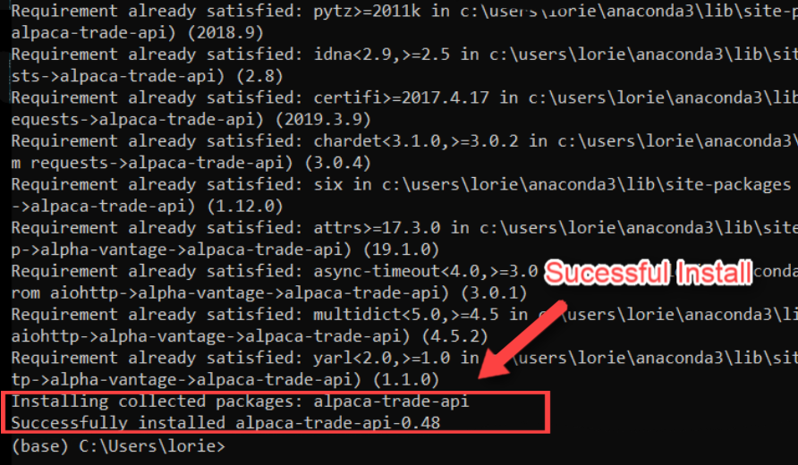
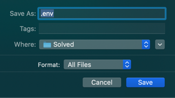

# Alpaca Markets (python-sdk) Installation Guide

This guide serves as a step by step process for setting up and validating the `Alpaca Markets trade API` Python SDK. Without this library, class activities and code will not be able to extract historical stock data and therefore, will not be able to be completed.

## Install

In order for the `alpaca-trade-api` package to install and run properly, all of the dependencies must be satisfied. The dependencies list can be found below for reference.

* Pandas

* Requests

* Dotenv

To verify the installation of a package, run `conda list package_name` in your terminal, substituting `package_name` for the actual package name.

If `Dotenv` is not installed, you can do so by running the following command in your terminal:

```python
pip install python-dotenv
```

To initiate the `alpaca-trade-api` install, open a terminal and execute the following command:

* Use the `pip install` command to download the `alpaca-trade-api` module.

  ```shell
  pip install alpaca-trade-api
  ```

  

## Verify Installation

Once the `alpaca-trade-api` download is complete, verify the installation completed successfully.

* Use the `conda list package_name` terminal command, substituting `package_name` for the actual package name, to determine if the `alpaca-trade-api` library installed successfully.

  ```shell
  conda list alpaca-trade-api
  ```

  

## Set ALPACA_API_KEY and ALPACA_SECRET_KEY environment variables

In order to use the Alpaca trade SDK, you will need to set your `ALPACA_API_KEY` and `ALPACA_SECRET_KEY` environment variables before using the library, as Alpaca communicates with the Alpaca API.

Go to [Alpaca Markets](https://app.alpaca.markets) and login to your account. After logging in you will be taken to a page that looks like this and will probably display a form asking you for personal information. **YOU DO NOT NEED TO ENTER THIS INFORMATION**


Now, click the `Go to Paper Account` link in the navigation sidebar.

  

Now click on the `Your API Keys` section and grab your `ALPACA_API_KEY` and `ALPACA_SECRET_KEY`.

  

Next, open or create a new `.env` file where you will store your keys and use the following syntax.

**Note**: Make sure your environment variables are specifically named `ALPACA_API_KEY` and `ALPACA_SECRET_KEY`.

  

Save this file in the same folder as your python script or jupyter notebook file. If the file is not already created save it as `.env`.

  

  

## Enabling Hidden Files

To work with `.env` files on your machine you will need to be able to view hidden files on your machine.

  * Windows

    * Type `folder` in search bar.
    * Select `File Explorer Options`.
    * Click the `View` tab in the pop up box, then click `Show hidden files, folders and drives` as shown below:

    

  * Mac OSX

    * Open Finder

    * Press Command + Shift + Dot

  * Linux (Ubuntu)

    * Open your file manager

    * Press Ctrl + H

## Usage

Lastly, run `jupyter-lab`. You may have to restart `jupyter-lab` if it is already running in the terminal in order for `jupyter-lab` to re-scan the environment for new variables.

## Troubleshooting

It can be frustrating when packages do not install correctly, therefore use the below approaches to troubleshoot any installation or usage issues.

### Update Conda Environment

An out-of-date Anaconda environment can create issues when trying to install new packages. Follow the steps below to update your conda environment.

1. Deactivate your current conda environment. This is required in order to update the global conda environment. Be sure to quit any running applications, such as Jupyter, prior to deactivating the environment.

    ```shell
    conda deactivate
    ```

2. Update conda.

    ```shell
    conda update conda
    ```

3. Create a fresh conda environment to use with alpaca.

    ```shell
    conda create -n alpacaenv python=3.7 anaconda
    ```

4. Activate the new environment.

    ```shell
    conda activate alpacaenv
    ```

5. Install the **alpaca-trade-api** package.

    ```shell
    pip install alpaca-trade-api
    ```

---

© 2019 Trilogy Education Services, a 2U, Inc. brand. All Rights Reserved.
