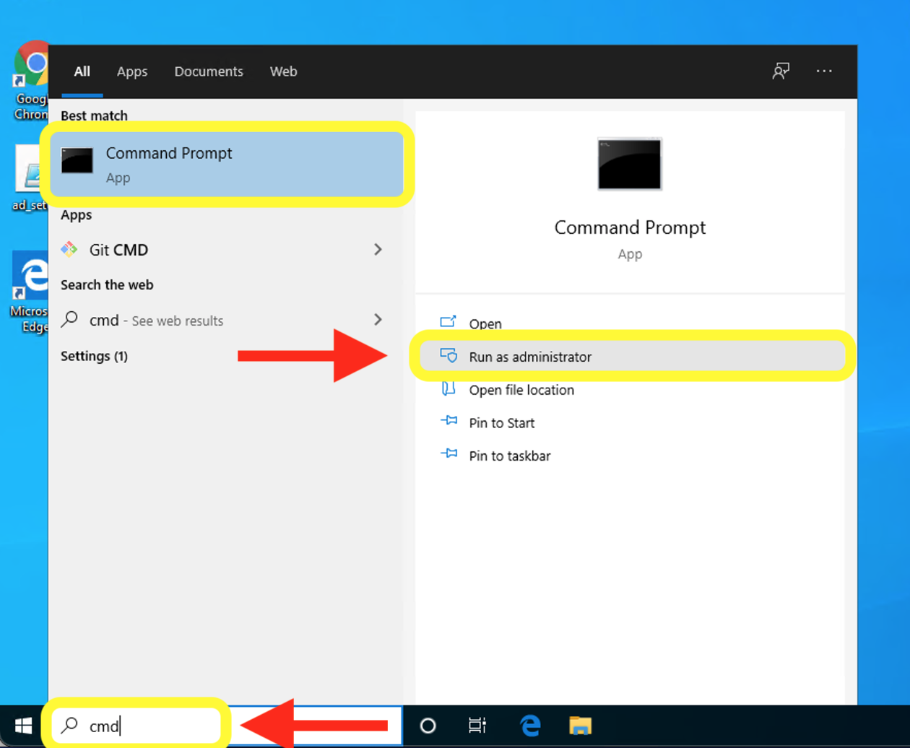
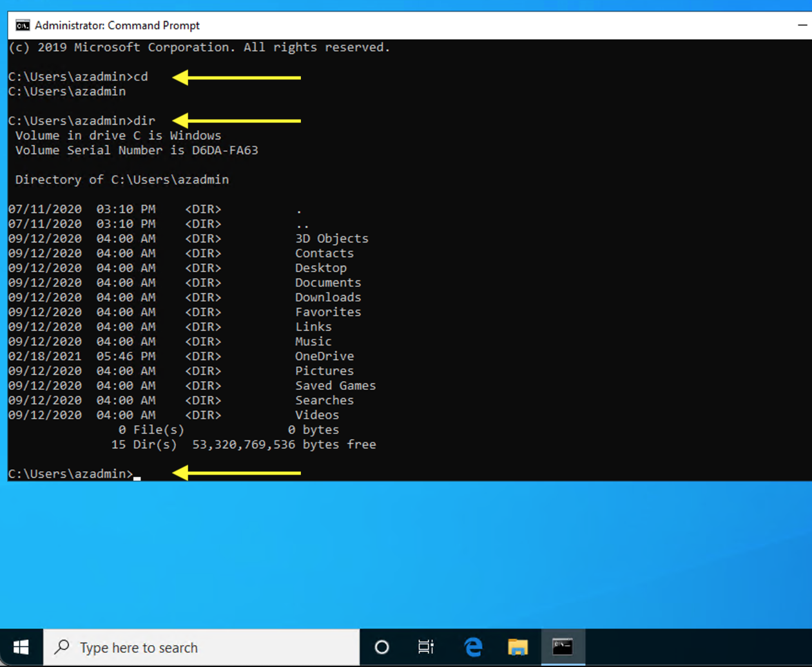

# Windows

PS                                  |CMD                                 |Git Bash               |Description
------------------------------------|------------------------------------|-----------------------|-----------
`Get-Location`                      |`cd`                                |`pwd`                  |
`Set-Location <path>`               |`chdir <path>` or `cd <path>`       |`cd <path>`            |
.                                   |`cls`                               |`clear`                |
`Get-Help <cmdlet> [-examples]`     |`cmd <command>`                     |`man <command>`        |
`Get-Command -Noun <noun>`          |                                    |                       |
`Get-Command -Verb <verb>`          |                                    |                       |
`Copy-Item`                         |`copy`                              |`cp`                   |
.                                   |`del` or `erase`                    |`rm` or `rm -r`        |
`Get-ChildItem`                     |`dir`                               |`ls`                   |
`Get-ChildItem -Path Env:`          |`dir env:`                          |                       | get all environment variables
`Get-ChildItem -Path Env:ComSpec`   |`dir env:ComSpec`                   |                       | get the environment variable called ComSpec
`Write-Output`                      |`echo`                              |`echo`                 |
.                                   |`exit`                              |`exit`                 |
.                                   |`find`                              |`grep`                 |
.                                   |`help <command>`                    |`man <command>`        |
`New-Item <name>`                   |`mkdir <name>` or `md <name>`       |`mkdir <name>`         |
`Move-Item`                         |`move`                              |`mv`                   |
`Remove-Item <name>`                |`rmdir <name>` or `rd <name>`       |`rmdir <name>`         |
`Remove-Item <name>`                |`rmdir /S <name>` or `rd /S <name>` |`rm -r <name>`         |
.                                   |`tree`                              |                       |
`Get-Content <name>`                |`type <name>`                       |`cat <name>`           |
`Get-Alias`                         |                                    |`alias`                |
`Stop-Process`                      |                                    |`kill`                 |
`Get-Process`                       |                                    |`ps`                   |
`Get-Service`                       |                                    |`service --status-all` |
`New-Item <name>`                   |                                    |`touch <name>`         |
`Get-ExecutionPolicy [-l or -list]` |                                    |                       |
`Set-ExecutionPolicy -ExecutionPolicy <policy> [-Scope <scope>]` |       |                       | <policy> may be RemoteSigned, Unrestricted, Undefined, etc.; <scope> may be LocalMachine, CurrentUser, etc.

## PS PowerShel

`$env:<env-var> -split ';'` 
`sfc /scannow` check for filesystem integrity 
`winver` get basic system information 

### Chocolatey Package Manager

`choco install` 
`choco uninstall` 

## CMD Windows Command Prompt

